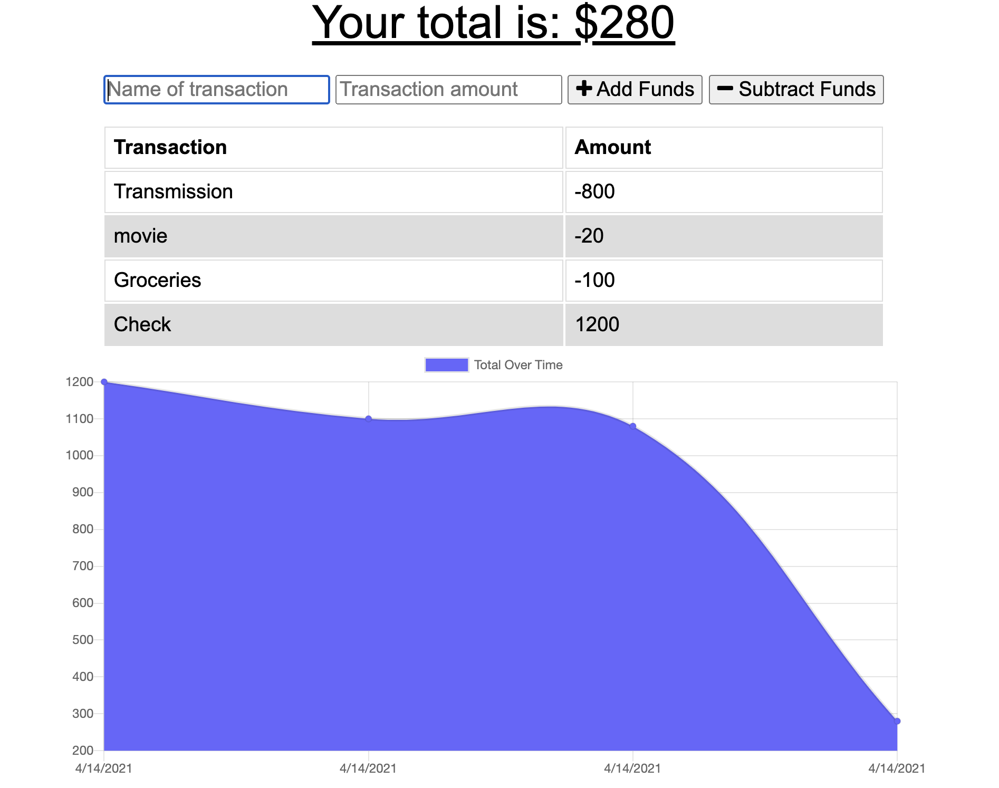

# Budget Tracker with Offline Functionality

## Description 

This application allows a user to input money transactions they make either in or out of their account and shows a graph of their total budget. This application has offline support through indexDB and a service-worker. 

## Table of Contents

* [Usage](#usage)
* [License](#license)
* [Questions](#questions)

## Usage 

To use this app go to https://ejbrownlf-budget-tracker.herokuapp.com/

At the top of the app you can input a transaction name and a numerical amout to associate it with. Then click the add or subtract button to to update your budget.

# License

This project is covered by the [MIT](https://opensource.org/licenses/MIT) License

# Questions

Here is a link to my [Github](https://github.com/ejbrownlf)

You can reach me by emailing me here at ejbrownlf@gmail.com

Link to my portfolio: https://ejbrownlf.github.io/pages/portfolio.html

